# 🧪 VocalLab — AI-Powered Chemistry Lab Instructor

[](https://github.com/kiran797979/Vocallab)
[](https://expo.dev)
[](https://python.org)
[](https://www.amd.com/en/technologies/ryzen-ai)

> **VocalLab** is a state-of-the-art AI lab assistant that transforms any smartphone into an intelligent laboratory instructor. Using real-time computer vision, voice guidance in 4 regional languages, and proactive safety monitoring, it guides students through complex experiments safely and effectively.

---

## 🎯 Core Value Proposition

- 📱 **Intelligent Guidance** — Point your camera at equipment to receive instant, context-aware voice instructions.
- 🔬 **Real-time Computer Vision** — Custom-tuned YOLOv8 model detects 20+ lab items with high precision.
- 🗣️ **Multilingual Support** — Full support for **Hindi, English, Telugu, and Tamil**, including UI and Audio instructions.
- 🛡️ **Safety Sentinel** — AI-powered proactive alerts for improper equipment handling or hazardous proximity.
- 📊 **Live Instructor Control** — A premium glassmorphic dashboard for monitoring an entire classroom in real-time.

---

## 🏛️ System Architecture

```mermaid
graph TD
    A[📱 Mobile Client] -- frames/state --> B(🖥️ FastAPI Backend)
    B -- detections/audio/status --> A
    B -- global stats/logs --> C[📊 Instructor Dashboard]
    C -- control signals --> B
    
    subgraph "AI Core"
    B --> D{YOLOv8 Engine}
    B --> E{Experiment FSM}
    D -- AMD Ryzen™ AI --> D
    end
```



---

## 🛠️ Technical Innovations (v3.3)

### 🧩 Mobile Resilience
- **Expo SDK 54 Migration**: Upgraded to the latest production-stable Expo SDK for enhanced performance and modern React 19 support.
- **Dynamic Capture Lock**: Implemented a recursive `setTimeout` loop with an asynchronous concurrency lock to prevent camera hardware crashes during high-frequency frame capture.
- **Smart IP Detection**: Zero-config connection logic using `expo-constants` to automatically sync with the backend server.
- **Tunneling Technology**: Built-in support for **Tunnel Mode** to bypass local Wi-Fi isolation and firewall restrictions.

### 🎨 Premium UI/UX
- **Aesthetic Excellence**: Dark-mode primary theme with `#00d4aa` (Emerald) accents and deep glassmorphic cards.
- **Micro-Animations**: Real-time scan-line animations, glowing HUD elements, and smooth layout transitions (animated dot progress).
- **Haptic Feedback**: Contextual haptics for safety alerts and step completions to improve accessibility.

---

## 🔬 Supported Lab Equipment (COCO Proxies)

| Object Label | Real Lab Item | Logic Proxy |
|--------------|---------------|-------------|
| **Beaker** | `bottle` | Heat-resistant glass container |
| **Conical Flask** | `wine glass` | Titration vessel |
| **Dropper** | `mouse` | Precision liquid transport |
| **PH Meter** | `cell phone` | Digital measurement tool |
| **Lab Manual** | `book` | Written procedure tracker|
...and 15+ more mappings for professional lab simulation.

---

## 🚀 Quick Start Guide

### 1️⃣ Backend Setup (Python)
```bash
cd backend
python -m venv venv
.\venv\Scripts\activate  # Windows
pip install -r requirements.txt
python generate_audio.py # Create language assets
python main.py           # Starts on port 8000
```

### 2️⃣ Mobile Setup (React Native)
```bash
cd mobile
npm install --legacy-peer-deps
# Recommended: Run via Tunnel to bypass Wi-Fi issues
npm run tunnel
```

### 3️⃣ Dashboard Setup (Vite)
```bash
cd dashboard
npm install
npm run dev
```

---

## 📁 Repository Structure

- `backend/`: FastAPI server, YOLOv8 integration, and Multi-language FSM logic.
- `mobile/`: Premium Expo application with custom camera framework.
- `dashboard/`: Instructor-facing monitoring system with real-time WebSocket state.
- `mobile/fix-and-run.ps1`: Automated maintenance tool for dependency synchronization.

---

## 🌍 Social Impact & AMD Vision

VocalLab is designed to address the laboratory equipment shortage for **500M+ students** in India. By leveraging everyday objects as digital proxies and providing instructions in native tongues, we democratize elite science education. Powered by **AMD Ryzen™ AI**, VocalLab delivers a local, private, and high-performance AI experience that works even in resource-constrained environments.

---

<p align="center">
  <b>Built with ❤️ by the VocalLab Team</b><br/>
  <i>Advancing science education through Pervasive AI.</i>
</p>
